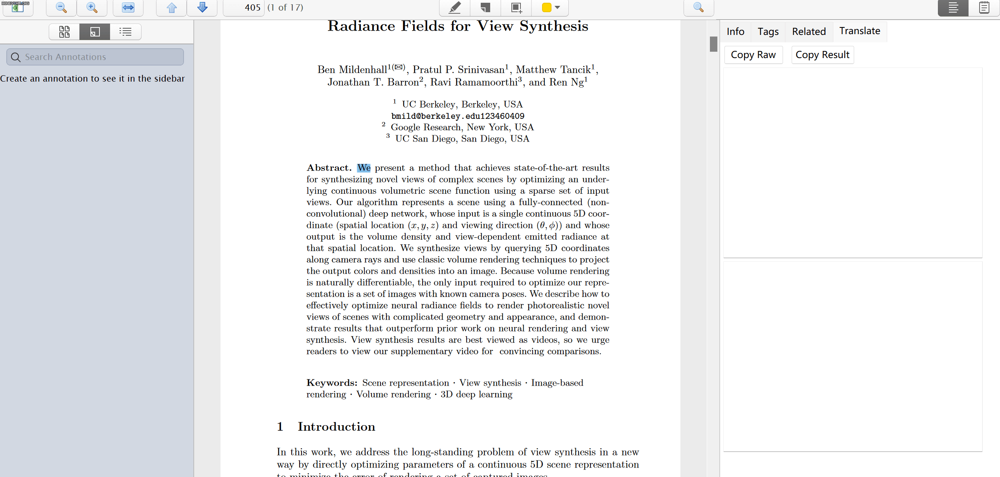
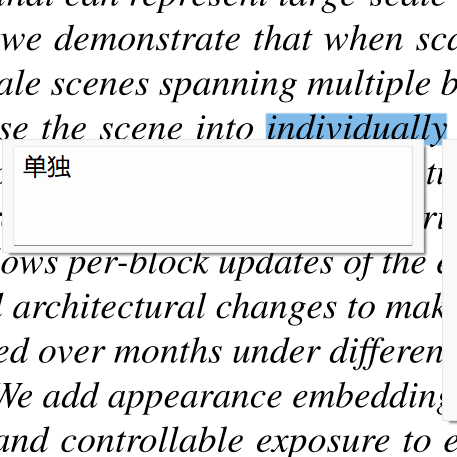
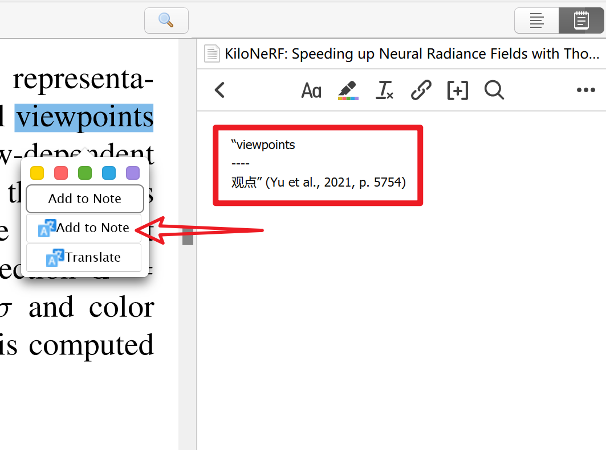
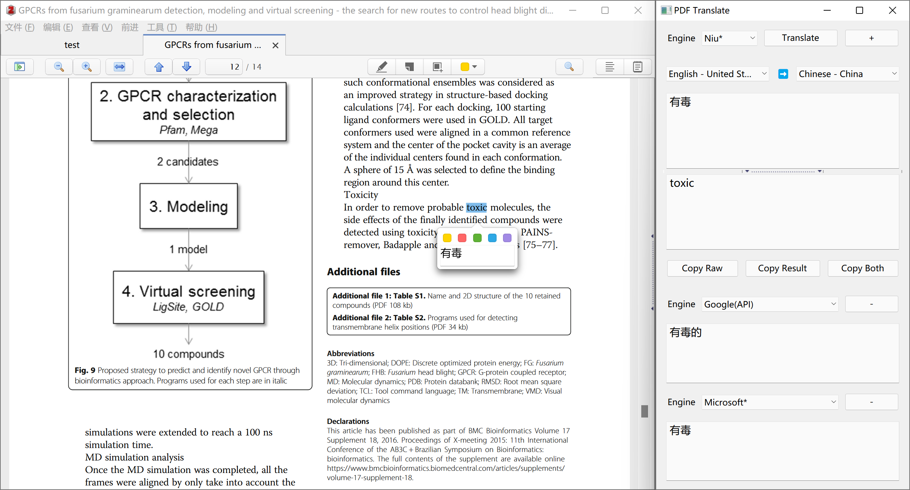

# Zotero PDF Translate

This is an add-on for [Zotero 6](https://www.zotero.org/)'s built-in PDF reader.  
Translate PDFs, annotations, notes, and item titles automatically.



# Quick Start Guide

## Install

- Download the latest release (.xpi file) from the [Releases Page](https://github.com/windingwind/zotero-pdf-translate/releases)  
  _Note_ If you're using Firefox as your browser, right-click the `.xpi` and select "Save As.."
- In Zotero click `Tools` in the top menu bar and then click `Addons`
- Go to the Extensions page and then click the gear icon in the top right.
- Select `Install Add-on from file`.
- Browse to where you downloaded the `.xpi` file and select it.
- Restart Zotero, by clicking `restart now` in the extensions list where the
  Zotero PDF Translate plugin is now listed.

## Usage

Once you have the plugin installed simply, open any PDF in your collections.

- Select some text, the translations are shown on the popup and the right sidebar(v0.2.0); Hold `Alt/Option` to concat selections.
  

- Highlight some text, the translations are added to the annotation comment(v0.3.0); Modify & retranslate the annotation text in the sidebar and click the `Update Annotation` to modify the annotation text and translation(v0.6.6);
- Add selected text along with translation to note(v0.4.0); _Only works when a note editor is active._
  
- Translate item titles with right-click menu or shortcut `Ctrl+T`(v0.6.0).
- Translate item abstract with right-click menu(v0.8.0). Thanks @iShareStuff
- Standalone translation window available(v0.7.0). View & compare translations from multiply engines in one window!
  
- Dictionary for single word translation(v0.7.1). _Only for en2zh and en2en now_

### Q&A

**Q** I want to translate manually.  
**A** Go to `Edit->Preferences->PDF Translate->General`, uncheck the `Automatic Translation`. Click the `translate` button on the popup or sidebar to translate.

**Q** I want a translate shortcut.  
**A**
Press shortcut `Ctrl+T` after you selected some text. If you are in the collection view, the titles' translation will show/hide.

**Q** I want to concat different seletions and translate them together.  
**A** Press `Alt/Option` when selecting text in PDF.

**Q** Not the language I want.  
**A** The default target language is the same as your Zotero language. Go to `Edit->Preferences->PDF Translate->General` and change the language settings.

**Q** Translation not correct or report an error.  
**A** See [Language Settings](#general-language-settings) and #6. Make sure you use the right secret.

**Q** I want to change the font size.  
**A** Go to `Edit->Preferences->PDF Translate->Advanced` and set the font size.

## Settings

### General-Functions

- Enable Translation, default `true`
- Automatic Translation, default `true`
- Enable Dictionary: single word will be translated using dictionary-engine instead of translate engine, default `true`
- Enable Popup: Show results in a right-click popup or only in the sidebar, default `true`
- Automatic Annotation Translation: Save annotation's translation as comment, default `true`
- Enable Update and Edit Last Annotation Translation, default `true`
- Show 'Add to Note' in Popup: default `true`
  > Unvisible if no active note editor opened.

### General-Translate Engine

The default engine is Google Translate. Currently, we support:  
| Translate Engine | Require Secret | Supported Languages |
| ---- | ---- | ---- |
| Google Translate | No | [100+](https://translate.google.com/about/languages/) |
| Google Translate(API) | No | Use `translate.googleapis.com` |
| Youdao Translate | No | [100+?](https://ai.youdao.com/DOCSIRMA/html/%E8%87%AA%E7%84%B6%E8%AF%AD%E8%A8%80%E7%BF%BB%E8%AF%91/API%E6%96%87%E6%A1%A3/%E6%96%87%E6%9C%AC%E7%BF%BB%E8%AF%91%E6%9C%8D%E5%8A%A1/%E6%96%87%E6%9C%AC%E7%BF%BB%E8%AF%91%E6%9C%8D%E5%8A%A1-API%E6%96%87%E6%A1%A3.html) |
| Youdao Zhiyun | Yes | [100+](https://ai.youdao.com/DOCSIRMA/html/%E8%87%AA%E7%84%B6%E8%AF%AD%E8%A8%80%E7%BF%BB%E8%AF%91/API%E6%96%87%E6%A1%A3/%E6%96%87%E6%9C%AC%E7%BF%BB%E8%AF%91%E6%9C%8D%E5%8A%A1/%E6%96%87%E6%9C%AC%E7%BF%BB%E8%AF%91%E6%9C%8D%E5%8A%A1-API%E6%96%87%E6%A1%A3.html) |
| Niu Translate(Trial) | No | [100+](https://niutrans.com/documents/contents/trans_text#accessMode) **UNSTABLE** |
| Niu Translate | Yes | [100+](https://niutrans.com/documents/contents/trans_text#accessMode) |
| Microsoft Translate | Yes(free 2M) | [200+](https://docs.microsoft.com/en-us/azure/cognitive-services/translator/language-support) |
| LingoCloud(Caiyun) Translate | Yes | [zh, en, ja, es, fr, ru](https://open.caiyunapp.com/LingoCloud_API_in_5_minutes) |
| DeepL Translate | Yes(free 500k) | [100+](https://www.deepl.com/pro?cta=header-prices/#developer) |
| Baidu Translate | Yes(free-QPS1/free-2M) | [200+](https://fanyi-api.baidu.com/product/11) |
| Baidu Field | Yes(free-QPS1/free-2M) | [en-zh](https://fanyi-api.baidu.com/product/12) |
| Tencent Translate | Yes(QPS5, free-5M) | [15](https://cloud.tencent.com/document/product/551/7372) |

> If the engine you want is not yet supported, please post an issue.

### General-Language Settings

You can change the source and target language here. For some Translate Engines, the `secret` is required. They are listed below:

**Microsoft Translate**  
Apply [here](https://docs.microsoft.com/en-us/azure/cognitive-services/translator/quickstart-translator?tabs=csharp). Copy your secret and paste it into the settings.  
The secret format is `MY_SECRET`.

> See [this issue](https://github.com/windingwind/zotero-pdf-translate/issues/3#issuecomment-1064688597) for detailed steps to set up the Microsoft Translate.

**DeepL Translate**  
Apply [here](https://www.deepl.com/pro?cta=header-prices/#developer).

**Youdao Zhiyun Translate 有道智云**  
Apply [here](https://ai.youdao.com/login.s).  
The secret format is `MY_APPID#MY_SECRET#MY_VOCABID(optional)`.

> About `VOCABID`  
> 登录控制台，选择文本翻译服务，点击右侧的术语表，选择新建，填写表名称和语言方向，添加需要的术语表，然后获取对应词表 id 即可。

> [Official Document](https://ai.youdao.com/DOCSIRMA/html/%E8%87%AA%E7%84%B6%E8%AF%AD%E8%A8%80%E7%BF%BB%E8%AF%91/API%E6%96%87%E6%A1%A3/%E6%96%87%E6%9C%AC%E7%BF%BB%E8%AF%91%E6%9C%8D%E5%8A%A1/%E6%96%87%E6%9C%AC%E7%BF%BB%E8%AF%91%E6%9C%8D%E5%8A%A1-API%E6%96%87%E6%A1%A3.html)

**Niu Translate**  
Apply [here](https://niutrans.com/NiuTransAuthCenter/login).  
The secret format is `MY_APIKEY`.

> [Chinese Document](https://doc.tern.1c7.me/zh/folder/setting/#%E5%B0%8F%E7%89%9B)

**Baidu Translate**  
Apply [here](https://fanyi-api.baidu.com/product/11).  
The secret format is `MY_APPID#MY_KEY`(split with '#').

**Baidu Field Translate 百度垂直领域翻译**  
Apply [here](https://fanyi-api.baidu.com/product/12).  
The secret format is `MY_APPID#MY_KEY#DOMAIN_CODE`(split with '#').

| Domain Code | 领域         | 语言方向    |
| ----------- | ------------ | ----------- |
| electronics | 电子科技领域 | 中文-->英语 |
| finance     | 金融财经领域 | 中文-->英语 |
| finance     | 金融财经领域 | 英语-->中文 |
| mechanics   | 水利机械领域 | 中文-->英语 |
| medicine    | 生物医药领域 | 中文-->英语 |
| medicine    | 生物医药领域 | 英语-->中文 |
| novel       | 网络文学领域 | 中文-->英语 |

> [Chinese Document](https://doc.tern.1c7.me/zh/folder/setting/#%E8%85%BE%E8%AE%AF%E4%BA%91)

**Tencent Translate**  
Apply [here](https://cloud.tencent.com/product/tmt).  
The secret format is `secretId#SecretKey#Region(optional, default ap-shanghai)#ProjectId(optional, default 0)`(split with '#').

> [Chinese Document](https://doc.tern.1c7.me/zh/folder/setting/#%E8%85%BE%E8%AE%AF%E4%BA%91)

**OpenL Translate**  
Apply [here](https://my.openl.club/).  
The secret format is `service1,service2,...#apikey`(split with '#'; split service codes with ',').

Supported service codes are: `deepl,youdao,tencent,aliyun,baidu,caiyun,wechat,sogou,azure,ibm,aws,google`, See [Service Code](https://docs.openl.club/#/API/format?id=%e7%bf%bb%e8%af%91%e6%9c%8d%e5%8a%a1%e4%bb%a3%e7%a0%81%e5%90%8d)

> [Chinese Document](https://docs.openl.club/#/)

### Advanced-UI

- `Font Size`: The font size of result text, default `12`
- `SideBar: Show xxx`: Show or hide sidebar elements, default `true`
- `SideBar: Reverse Raw/Result`: Reverse the order of Raw/Result in the sidebar if `true`, default `false`

### Advanced-Others

- Disable Automatic Translation when File Language is(split with ','): If you want to disable automatic translation in `zh` and `ja` files, set `zh,ja`.

## Development & Contributing

This section is for developers.

### Use this repo as a Zotero Addon Template

This repo can be used as a Zotero 6.x addon template. To start with, clone this repo and install npm dependencies:

```shell
git clone git@github.com:windingwind/zotero-pdf-translate.git
cd zotero-pdf-translate
npm i
```

Change the settings in `package.json`. Modify `addonRef` and `addonID` to avoid confliction.

### Directory Structure

This section shows the directory structure of a template.

- All `.js/.ts` code files are in `./src`;
- Addon config files: `./addon/chrome.manifest`, `./addon/install.rdf`;
- UI files: `./addon/chrome/content/*.xul`. The `overlay.xul` also defines the main entrance;
- Locale files: `./addon/chrome/locale/*.dtd`;
- Resource files: `./addon/chrome/skin/default/__addonRef__/*.dtd`;

```shell
│  .gitignore
│  .release-it.json # release-it conf
|  jsconfig.json    # https://code.visualstudio.com/docs/languages/jsconfig#
│  build.js         # esbuild
│  LICENSE
│  package.json     # npm conf
│  README.md        # readme
│  update.rdf       # addon update
│
├─.github           # github conf
│
├─addon             # addon dir
│  │  chrome.manifest  #addon conf
│  │  install.rdf   # addon install conf
│  │
│  └─chrome
│      ├─content    # UI
│      │  │  overlay.xul
│      │  │  preferences.xul
│      │  │  standalone.xul
│      │  │
│      │  └─scripts
│      ├─locale     # locale
│      │  ├─en-US
│      │  │      overlay.dtd
│      │  │
│      │  └─zh-CN
│      │         overlay.dtd
│      │
│      └─skin       # style
│          └─default
│              └─zoteropdftranslate
│                      favicon.png
│                      favicon@0.5x.png
│
├─builds            # build dir
│  └─zotero-pdf-translate.xpi
│
├─imgs              # readme images
│
└─src               # source code
    │  index.ts     # main entry
    │  base.ts      # base class
    │  PDFTranslate.ts  # main class
    │  events.ts    # events class
    │  reader.ts    # reader class
    │  translate.ts # translate class
    │  view.ts      # UI class
    │  prefs.ts     # preferences class
    │
    ├─translate     # translate engines
    │       baidu.ts
    │       caiyun.ts
    │       config.ts
    │       deepl.ts
    │       google.ts
    │       microsoft.ts
    │       niutrans.ts
    │       tencent.ts
    │       youdao.ts
    |
    └─dict          # dictionary engines
            youdaodict.ts
```

### Build

```shell
# A release-it command: version increase, npm run build, git push, and GitHub release
# You need to set the environment variable GITHUB_TOKEN https://github.com/settings/tokens
# release-it: https://github.com/release-it/release-it
npm run release
```

Alternatively, build it directly using build.js: `npm run build`

### Build Steps

1. Clean `./builds`
2. Copy `./addon` to `./builds`
3. Esbuild to `./builds/addon/chrome/content/scripts`
4. Replace `__buildVersion__` and `__buildTime__` in `./builds/addon`
5. Zip the `./builds/addon` to `./builds/*.xpi`

### Debug

1. Copy zotero command line config file. Modify the commands.

```sh
cp zotero-cmd-default.json zotero-cmd.json
```

2. Setup addon development environment following this [link](https://www.zotero.org/support/dev/client_coding/plugin_development#setting_up_a_plugin_development_environment).

3. Build addon and restart Zotero with this npm command.

```sh
npm run restart
```

You can also debug code in these ways:

- Test code segments in Tools->Developer->Run Javascript;
- Debug output with `Zotero.debug()`. Find the outputs in Help->Debug Output Logging->View Output;
- UI debug. Zotero is built on the Firefox XUL framework. Debug XUL UI with software like [XUL Explorer](https://udn.realityripple.com/docs/Archive/Mozilla/XUL_Explorer).
  > XUL Documents:  
  > https://www.xul.fr/tutorial/  
  > http://www.xulplanet.com/

### Contributing

**Search for a Zotero API**  
Zotero docs are outdated or incomplete. Searching the source code of Zotero is unavoidable.  
Clone https://github.com/zotero/zotero and search the keyword globally. You can search the UI text in `.xul`/`.dtd` files, and then search the keys of the text value in `.js`/`.xul` files.

**Persistence settings**  
Zotero Prefs can persistence a value. See `src/prefs.ts` and `addon/chrome/content/preferences.xul` for detailed usage in js/xul.

**Add a translate/dict engine**

1. Add a `.ts` file under `src/${translate or dict}` with the same format with other engines;
2. Update the sources, sourcesName, and defaultSecret in `src/config.ts`;
3. Update the `zotero-prefpane-__addonRef__-settings-${translate or dict}-source` menulist in `addon/chrome/content/preferences.xul`;
4. Update the ui entry of the `translate/dict engine` in `addon/chrome/locale/${en-US or zh-CN}/overlay.dtd`.
5. Import and add you `engine or dict` to the class `TransEngine` and `constructor` of `src/translate.ts`
6. Build and test.

## Disclaimer

Use this code under AGPL. No warranties are provided. Keep the laws of your locality in mind!

Part of the code of this repo refers to other open-source projects within the allowed scope.

- zotero-scihub
- zotero-tag
- zotero-better-bibtex(`d.ts`)

## My Other Zotero Addons

- [zotero-better-notes](https://github.com/windingwind/zotero-better-notes): Everything about note management. All in Zotero.
- [zotero-tag](https://github.com/windingwind/zotero-tag): Automatically tag items/Batch tagging
