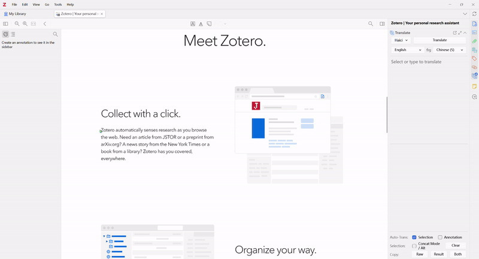
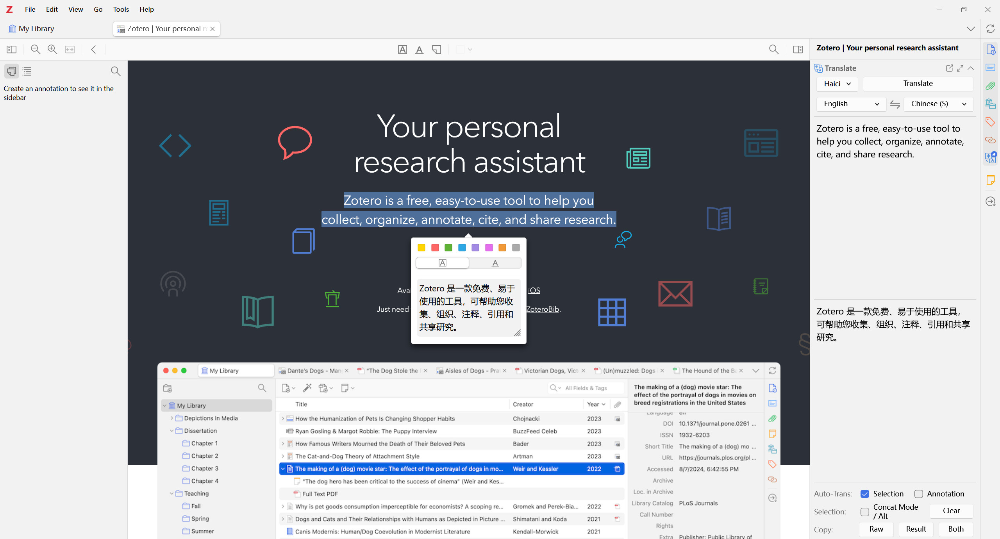
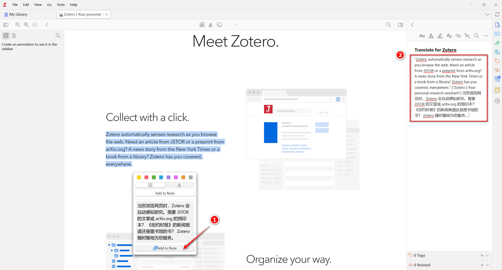
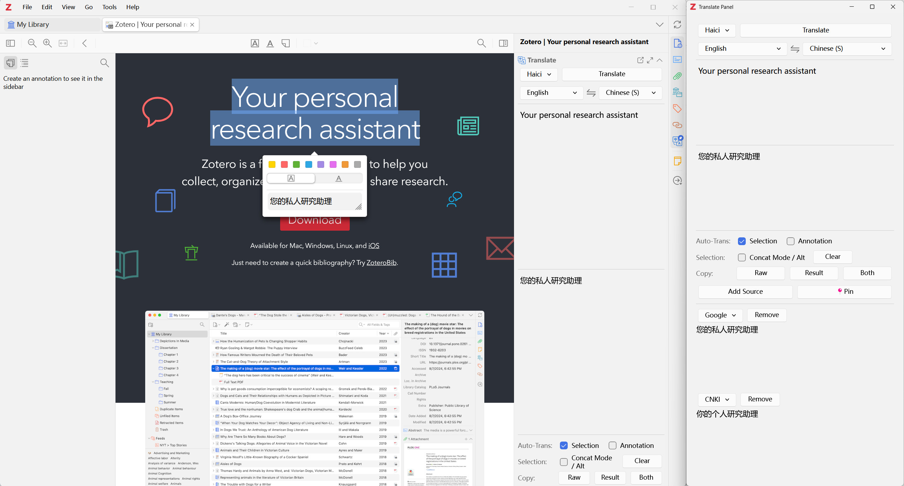

# Translate for Zotero

[](https://www.zotero.org)
[](https://github.com/windingwind/zotero-plugin-template)

_Translate for Zotero_, a.k.a. _Zotero PDF Translate_, is a [Zotero](https://www.zotero.org/) plugin.  
Translate PDF, EPub, webpage, metadata, annotations, notes to the target language. Support 20+ translate services.

[中文文档](https://zotero.yuque.com/books/share/4443494c-c698-4e08-9d1e-ed253390346d)



# Quick Start Guide

## Install

- Download the plugin (.xpi file) from below.

  - [Latest Stable](https://github.com/windingwind/zotero-pdf-translate/releases/latest)
  - [All Releases](https://github.com/windingwind/zotero-pdf-translate/releases)

  _Note_ If you're using Firefox as your browser, right-click the `.xpi` and select "Save As.."

- In Zotero click `Tools` in the top menu bar and then click `Plugins`
- Go to the Extensions page and then click the gear icon in the top right.
- Select `Install Plugin from file`.
- Browse to where you downloaded the `.xpi` file and select it.
- Finish!

## Usage

Once you have the plugin installed simply, open any PDF/EPub/webpage in your collections.

- Select some text, the translations are shown on the popup and the right sidebar(v0.2.0); Hold `Alt/Option` to concat selections.
  

- Highlight/Underline some text, the translations are added to the annotation comment(v0.3.0); Modify & retranslate the annotation text in the sidebar and click the `Update Annotation` to modify the annotation text and translation(v0.6.6);
- Add selected text along with translation to note(v0.4.0); _Only works when a note editor is active._
  

- Translate item titles with right-click menu or shortcut `Ctrl+T`(v0.6.0).
- Translate item abstract with right-click menu(v0.8.0). Thanks @iShareStuff
- Standalone translation window available(v0.7.0). View & compare translations from multiply engines in one window!
  

- Dictionary for single word translation(v0.7.1).
- SentenceBySentence Translation(v1.1.0). After a translation, press `shift`+`P` and select `Translate Sentences`. _Only for en2zh and en2en now_. Thanks @MuiseDestiny

### Q&A

**Q** I want to translate manually.  
**A** Go to `Edit->Settings->Translate->General`, uncheck the `Auto-Trans Selection`. Click the `Translate` button on the popup or sidebar to translate.

**Q** I want a translate shortcut.  
**A**
Press shortcut `Ctrl+T` after you selected some text. If you are in the collection view, the titles' translation will show/hide.

**Q** I want to concat different selections and translate them together.  
**A** Press `Alt/Option` when selecting text in PDF/EPub/webpage.

**Q** Not the language I want.  
**A** The default target language is the same as your Zotero language. Go to `Edit->Settings->Translate->Service` and change the language settings.

**Q** Translation not correct or report an error.  
**A** See _Language Settings_ above and FAQ([#6](https://github.com/windingwind/zotero-pdf-translate/issues/6)). Make sure you use the right secret.

**Q** I want to change the font size.  
**A** Go to `Edit->Settings->Translate->User Interface` and set the font size.

## Settings

### General

<!-- - Enable Translation, default `true` -->

- Automatic Translation, default `true`
- Automatic Annotation Translation: Save annotation's translation to annotation comment or annotation body, default `false`
- Enable Popup: Show results in the popup panel or only in the sidebar, default `true`
- Enable Dictionary: single word will be translated using dictionary-engine instead of translate engine, default `true`
- Show 'Add to Note(With Translation)' in Popup: default `true`
  > Invisible if no active note editor opened.
  - Replace Raw: Use translation to replace the raw text when adding to note, default `false`

### Service

The default engine is Google Translate. Currently, we support:  
| Translate Engine | Require Secret | Supported Languages |
| ---------------------------- | ---------------------- | ------------------------------------------------------------------------------------------------------------------------------------------------------------------------------------------------------------------------------------------------------------------ |
| Google Translate | No | [100+](https://translate.google.com/about/languages/) |
| Google Translate(API) | No | Use `translate.googleapis.com` |
| CNKI | No | https://dict.cnki.net |
| Youdao Translate | No | [100+?](https://ai.youdao.com/DOCSIRMA/html/%E8%87%AA%E7%84%B6%E8%AF%AD%E8%A8%80%E7%BF%BB%E8%AF%91/API%E6%96%87%E6%A1%A3/%E6%96%87%E6%9C%AC%E7%BF%BB%E8%AF%91%E6%9C%8D%E5%8A%A1/%E6%96%87%E6%9C%AC%E7%BF%BB%E8%AF%91%E6%9C%8D%E5%8A%A1-API%E6%96%87%E6%A1%A3.html) |
| NiuTrans | Yes | [400+](https://niutrans.com/documents/contents/trans_text#accessMode) |
| Youdao Zhiyun | Yes | [100+](https://ai.youdao.com/DOCSIRMA/html/%E8%87%AA%E7%84%B6%E8%AF%AD%E8%A8%80%E7%BF%BB%E8%AF%91/API%E6%96%87%E6%A1%A3/%E6%96%87%E6%9C%AC%E7%BF%BB%E8%AF%91%E6%9C%8D%E5%8A%A1/%E6%96%87%E6%9C%AC%E7%BF%BB%E8%AF%91%E6%9C%8D%E5%8A%A1-API%E6%96%87%E6%A1%A3.html) |
| Microsoft Translate | Yes(free 2M) | [200+](https://docs.microsoft.com/en-us/azure/cognitive-services/translator/language-support) |
| LingoCloud(Caiyun) Translate | Yes | [zh, en, ja, es, fr, ru](https://open.caiyunapp.com/LingoCloud_API_in_5_minutes) |
| DeepL Translate | Yes(free 500k) | [100+](https://www.deepl.com/pro?cta=header-prices/#developer) |
| Aliyun Translate | Yes(free-1M) | [200+](https://help.aliyun.com/document_detail/158269.html) |
| Baidu Translate | Yes(free-QPS1/free-2M) | [200+](https://fanyi-api.baidu.com/product/11) |
| Baidu Field | Yes(free-QPS1/free-2M) | [en-zh](https://fanyi-api.baidu.com/product/12) |
| Tencent Translate | Yes(QPS5, free-5M) | [15](https://cloud.tencent.com/document/product/551/7372) |
| GPT(OpenAI) | Yes(free-$18) | [Based on the gpt-3.5-turbo model](https://openai.com/pricing#chat) |
| Gemini | Yes(free-) | [Based on the Gemini Pro model](https://ai.google.dev/available_regions#available_languages) |

> If the engine you want is not yet supported, please post an issue.

**Google**  
Google does not require a secret, but you can put your own API URL in the secret to replace the default URL (translate.google.com/translate.googleapi.com).

**Microsoft Translate**  
Apply [here](https://docs.microsoft.com/en-us/azure/cognitive-services/translator/quickstart-translator?tabs=csharp). Copy your secret and paste it into the settings.  
The secret format is `MY_SECRET`.

> See [this issue](https://github.com/windingwind/zotero-pdf-translate/issues/3#issuecomment-1064688597) for detailed steps to set up the Microsoft Translate.

**DeepL Translate**  
Apply [here](https://www.deepl.com/pro?cta=header-prices/#developer).
The secret format is `secretToken` or `secretToken#glossaryId` (if you want to specify some translate glossary).

**Youdao Zhiyun Translate 有道智云**  
Apply [here](https://ai.youdao.com/login.s).  
The secret format is `MY_APPID#MY_SECRET#MY_VOCABID(optional)`.

> About `VOCABID`  
> 登录控制台，选择文本翻译服务，点击右侧的术语表，选择新建，填写表名称和语言方向，添加需要的术语表，然后获取对应词表 id 即可。
>
> [Official Document](https://ai.youdao.com/DOCSIRMA/html/%E8%87%AA%E7%84%B6%E8%AF%AD%E8%A8%80%E7%BF%BB%E8%AF%91/API%E6%96%87%E6%A1%A3/%E6%96%87%E6%9C%AC%E7%BF%BB%E8%AF%91%E6%9C%8D%E5%8A%A1/%E6%96%87%E6%9C%AC%E7%BF%BB%E8%AF%91%E6%9C%8D%E5%8A%A1-API%E6%96%87%E6%A1%A3.html)

**NiuTrans**  
Apply [here](https://niutrans.com/NiuTransAuthCenter/login).  
The secret format is `MY_APIKEY#dictNo(optional)#memoryNo(optional)`.

> [Chinese Document](https://doc.tern.1c7.me/zh/folder/setting/#%E5%B0%8F%E7%89%9B)

**Huoshan**
Apply [here](https://www.volcengine.com/docs/4640/65067)
The secret format is `accessKeyId#accessKeySecret`

**Aliyun Translate**
Apply [here](https://www.aliyun.com/product/ai/base_alimt).
The secret format is `accessKeyId#accessKeySecret#endpoint(optional)`.

> The endpoint is the region of the service, default `https://mt.aliyuncs.com`. For `cn-hangzhou`, the endpoint is `mt.cn-hangzhou.aliyuncs.com`. See also [here](https://help.aliyun.com/zh/machine-translation/developer-reference/api-alimt-2018-10-12-endpoint?spm=a2c4g.11186623.help-menu-30396.d_4_1_0.6c702fa7WlNkX1).

> [Chinese Document](https://help.aliyun.com/document_detail/158269.html)

**Baidu Translate**  
Apply [here](https://fanyi-api.baidu.com/product/11).  
The secret format is `MY_APPID#MY_KEY#ACTION(optional, see https://api.fanyi.baidu.com/doc/21, default 0)`(split with '#').

**Baidu Field Translate 百度垂直领域翻译**  
Apply [here](https://fanyi-api.baidu.com/product/12).  
The secret format is `MY_APPID#MY_KEY#DOMAIN_CODE`(split with '#').

| Domain Code | 领域         | 支持语言方向                          |
| ----------- | ------------ | ------------------------------------- |
| it          | 信息技术领域 | 中文（简）-> 英语、英语 -> 中文（简） |
| finance     | 金融财经领域 | 中文（简）-> 英语、英语 -> 中文（简） |
| machinery   | 机械制造领域 | 中文（简）-> 英语、英语 -> 中文（简） |
| senimed     | 生物医药领域 | 中文（简）-> 英语、英语 -> 中文（简） |
| novel       | 网络文学领域 | 中文（简）-> 英语                     |
| academic    | 学术论文领域 | 中文（简）-> 英语、英语 -> 中文（简） |
| aerospace   | 航空航天领域 | 中文（简）-> 英语、英语 -> 中文（简） |
| wiki        | 人文社科领域 | 中文（简）-> 英语                     |
| news        | 新闻资讯领域 | 中文（简）-> 英语、英语 -> 中文（简） |
| law         | 法律法规领域 | 中文（简）-> 英语、英语 -> 中文（简） |
| contract    | 合同领域     | 中文（简）-> 英语、英语 -> 中文（简） |

> [Chinese Document](https://doc.tern.1c7.me/zh/folder/setting/#%E8%85%BE%E8%AE%AF%E4%BA%91)

**Tencent Translate**  
Apply [here](https://cloud.tencent.com/product/tmt).  
The secret format is `secretId#SecretKey#Region(optional, default ap-shanghai)#ProjectId(optional, default 0)`(split with '#').

> [Chinese Document](https://doc.tern.1c7.me/zh/folder/setting/#%E8%85%BE%E8%AE%AF%E4%BA%91)

**OpenL Translate**  
Apply [here](https://my.openl.club/).  
The secret format is `service1,service2,...#apikey`(split with '#'; split service codes with ',').

Supported service codes are: `deepl,youdao,tencent,aliyun,baidu,caiyun,wechat,sogou,azure,ibm,aws,google`, See [Service Code](https://docs.openl.club/#/API/format?id=%e7%bf%bb%e8%af%91%e6%9c%8d%e5%8a%a1%e4%bb%a3%e7%a0%81%e5%90%8d)

> [Chinese Document](https://docs.openl.club/#/)

**GPT**  
Apply [here](https://platform.openai.com/signup).  
The secret format is `sk-#SecretKey`(split with '#').

Support third-party compatible APIs.

> [Chinese Document](https://gist.github.com/GrayXu/f1b72353b4b0493d51d47f0f7498b67b)

### User Interface

- `Font Size`: The font size of result text, default `12`
- `Line Height`: The line height of result text, default `1.5`
- `Item Menu: Show xxx`: Show or hide Title/Abstract tanslation, default `true`
- `SideBar: Show xxx`: Show or hide sidebar elements, default `true`
- `SideBar: Reverse Raw/Result`: Reverse the order of Raw/Result in the sidebar if `true`, default `false`
- `Item Pane Info: Show xxx`: Show or hide Title/Abstract tanslation in the item info rows
- `Standalone: Keep Windows on Top`: Top the standalone translate panel if `true`, default `false`
- `Popup: Remember Size`: Remember size of popup if `true`, else automatically adjust the size, default `false`

### Advanced

- Auto Detect Item Language
  - Disable Automatic Translation when File Language is(split with ','): If you want to disable automatic translation in `zh` and `ja` files, set `zh,ja`.
- Split Character(between text and translation): When translating annotations, the result will be wrapped inside this character to allow safe re-translate. If set to empty, re-translating annotations will replace the annotation comment with the new translate result.

## Development & Contributing

This plugin is built based on the [Zotero Plugin Template](https://github.com/windingwind/zotero-plugin-template). See the setup and debug details there.

To startup, run

```bash
git clone https://github.com/windingwind/zotero-pdf-translate.git
cd zotero-pdf-translate
npm install
npm run build
```

The plugin is built to `./build/*.xpi`.

### Contributing

**Add new translate service**

1. Add service config to `src/utils/config.ts` > `SERVICES`;
2. Add translation task processor under `src/modules/services/${serviceId}.ts` with the same format with other services. The export function set the translation result to `data.result` if runs successfully and throw an error if fails;
3. Import the task processor function in `src/modules/services/index.ts`.
4. Add locale string `service.${serviceId}` in `addon/chrome/locale/${lang}/addon.properties`.
5. Build and test.

**Extra options for translate service**

If the service requires extra options, the minimal implement would be putting them in the `secret` input in the prefs window, like the existing services does.

If there are complex options, please bind a callback in `src/modules/settings/index.ts > secretStatusButtonData` which create a highly customizable dialog window with `ztoolkit.Dialog`. See the example of NiuTrans login here: https://github.com/windingwind/zotero-pdf-translate/blob/main/src/modules/settings/niutrans.ts

## Disclaimer

Use this code under AGPL. No warranties are provided. Keep the laws of your locality in mind!

## My Other Zotero Addons

- [Better Notes](https://github.com/windingwind/zotero-better-notes): Everything about note management. All in Zotero.
- [Actions & Tags](https://github.com/windingwind/zotero-tag): Automatically tag items/Batch tagging

## Sponsors

Thanks
[peachgirl100](https://github.com/peachgirl100)
and other anonymous sponsors!

If you want to leave your name here, please email me or leave a message with the donation.

## Contributors

<a href="https://github.com/windingwind/zotero-pdf-translate/graphs/contributors">
  
</a>
