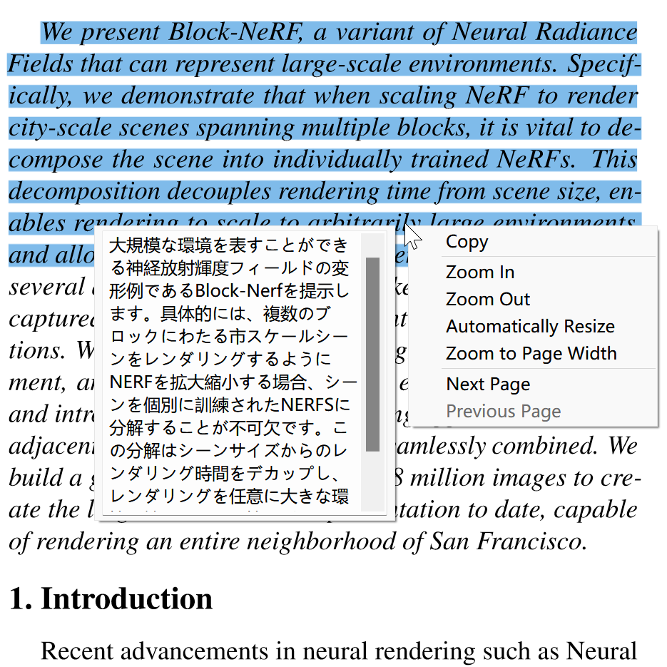
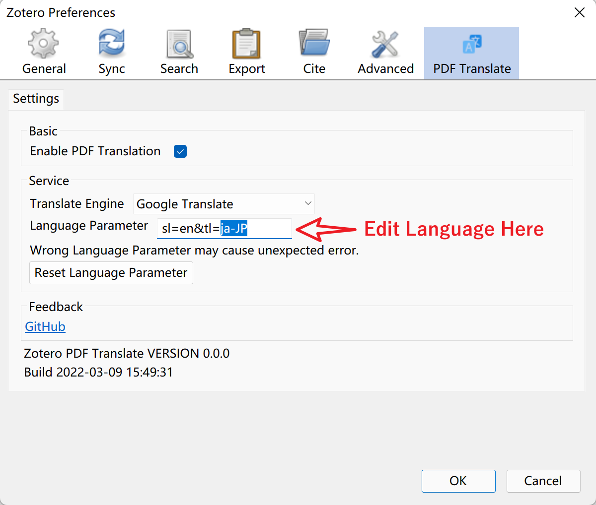

# Zotero PDF Translate
This is an add-on for [Zotero 6](https://www.zotero.org/). It provides PDF translation for Zotero inner PDF reader.



# Quick Start Guide

## Install
- Download the latest release (.xpi file) from the [Releases Page](https://github.com/windingwind/zotero-pdf-translate/releases)
*Note* If you're using Firefox as your browser, right click the xpi and select "Save As.."
- In Zotero click "Tools" in the top menu bar and then click "Addons"
- Go to the Extensions page and then click the gear icon in the top right.
- Select Install Add-on from file.
- Browse to where you downloaded the .xpi file and select it.
- Restart Zotero, by clicking "restart now" in the extensions list where the
Zotero PDF Translate plugin is now listed.

## Usage
Once you have the plugin installed simply, open any PDF in your collections.  
Select some text, then rightclick: the translation are shown.  
Not the lauguage you want? The default tartget lauguage is `zh-CN`(Chinese Simplified). You can edit it in the Preference menu.


## Settings
-  Translate Engine  
The default engine is Google Translate. Currently we provide Youdao as optional engine.  
如果你无法访问谷歌，请选择有道作为翻译引擎。Youdao doesn't support some lauguages.

- Lauguage Parameter  
Edit here to change translation target language.  
Find your *Language Culture Code* in this link:
[Language Culture Code](./LangCultureName.md)  
Take `ja-JP` as example:  
For Google Translate users, the *Lauguage Parameter* is `sl=en&tl=ja-JP`. Here `sl` is source language and `tl` is target language.  
For youdao(有道) users,  the *Lauguage Parameter* is `EN2JA-JP`. It means from `EN(English)` to  `JA_JP(Japnese)`.



## Building

Invoke make with the VERSION variable set in the environment. For example:

````
VERSION=0.0.1 make
````

Alternatively, version numbers can be passed to make directly:

````
make VERSION=0.0.1
````

## Disclaimer
Use this code at your own peril. No warranties are provided. Keep the laws of your
locality in mind!

Part of the code of this repo refers to other open-source projects within the allowed scope.
- zotero-scihub
- zotero-tag

## My Other Zotero Addons
- [zotero-tag](https://github.com/windingwind/zotero-tag): Automatically tag items/Batch tagging
